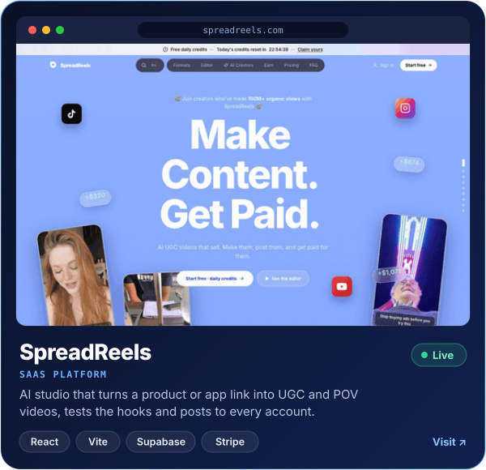
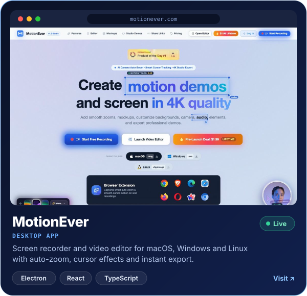
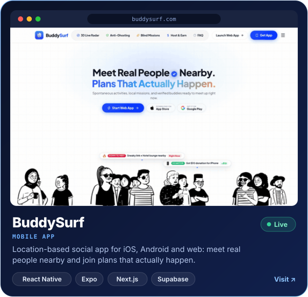
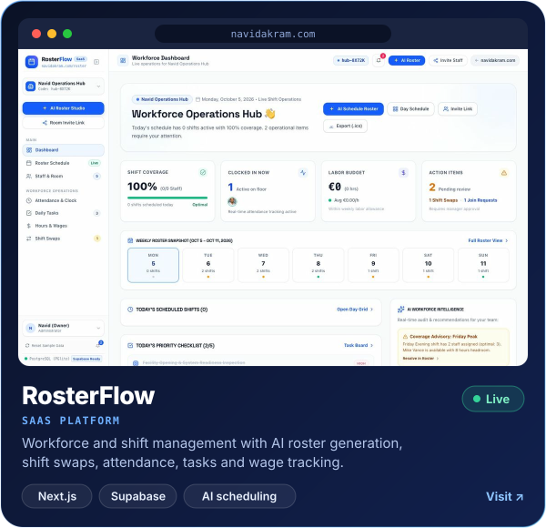
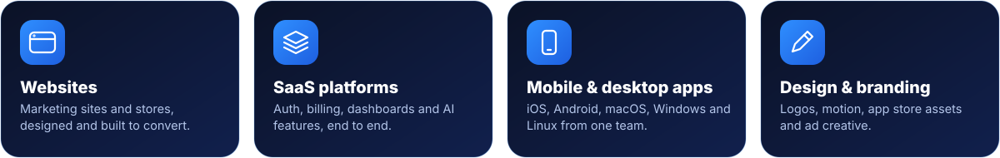
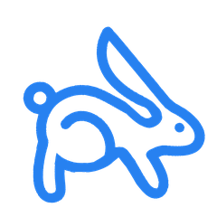

  

  
  
  
  
  
  

## Hi, I'm Navid

I'm a full-stack developer based in Cork, Ireland, and the founder of [Rabbit Guy Ltd](https://rabbitguy.com), a UK registered company. I design and build SaaS platforms, websites, and mobile and desktop apps, and I run my own products alongside client work.

  

  

## What I'm building

  
  

  
  

## What I do

  

## Tech stack

  

 

  

  
   
  <b>Rabbit Guy Ltd</b> · UK company no. 16068046 · Design. Build. Launch.

