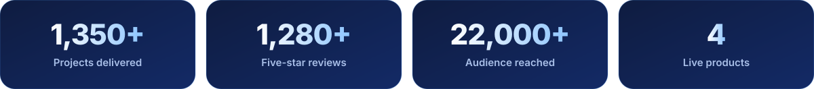
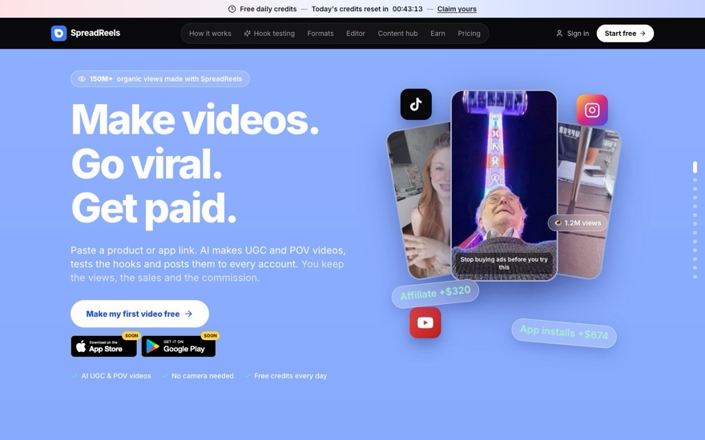
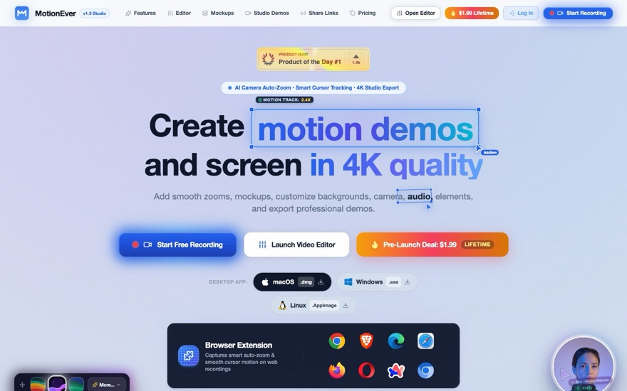
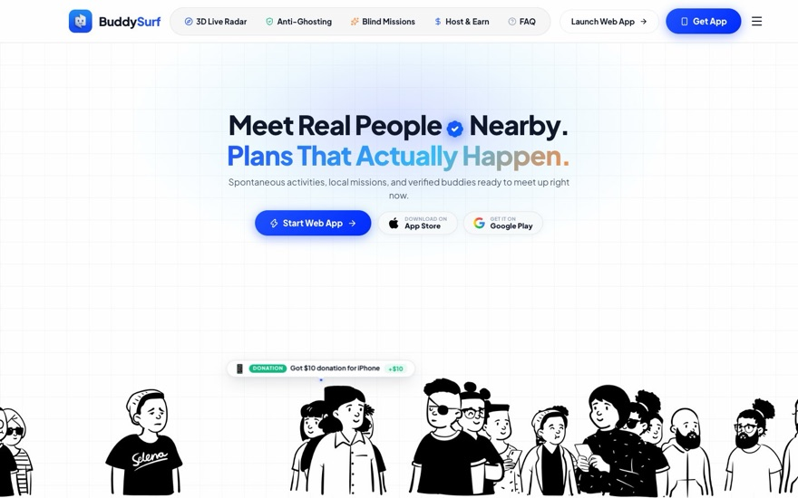
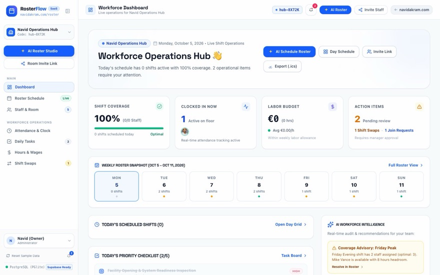
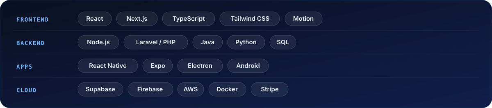

  

  <a href="https://navidakram.com"><b>Portfolio</b></a> &nbsp;·&nbsp;
  <a href="https://rabbitguy.com"><b>Rabbit Guy</b></a> &nbsp;·&nbsp;
  <a href="https://linkedin.com/in/navidakram"><b>LinkedIn</b></a> &nbsp;·&nbsp;
  <a href="mailto:Me@navidakram.com"><b>Email</b></a>

## Hi, I'm Navid

I'm a full-stack developer based in Cork, Ireland, and the founder of [Rabbit Guy Ltd](https://rabbitguy.com), a UK registered company. I design and build SaaS platforms, websites, and mobile and desktop apps, and I run my own products alongside client work.

  

## What I'm building

<table>
  <tr>
    <td width="50%" valign="top">
      
      <h3><a href="https://spreadreels.com">SpreadReels</a></h3>
      
AI studio that turns a product or app link into UGC and POV videos, tests the hooks and posts to every account.

      
<code>React</code> <code>Vite</code> <code>Supabase</code> <code>Stripe</code>

    </td>
    <td width="50%" valign="top">
      
      <h3><a href="https://motionever.com">MotionEver</a></h3>
      
Screen recorder and video editor for macOS, Windows and Linux with auto-zoom, cursor effects and instant export.

      
<code>Electron</code> <code>React</code> <code>TypeScript</code>

    </td>
  </tr>
  <tr>
    <td width="50%" valign="top">
      
      <h3><a href="https://buddysurf.com">BuddySurf</a></h3>
      
Location-based social app for iOS, Android and web: meet real people nearby and join plans that actually happen.

      
<code>React Native</code> <code>Expo</code> <code>Next.js</code> <code>Supabase</code>

    </td>
    <td width="50%" valign="top">
      
      <h3><a href="https://navidakram.com">RosterFlow</a></h3>
      
Workforce and shift management SaaS with AI roster generation, shift swaps, attendance, tasks and wage tracking.

      
<code>Next.js</code> <code>Supabase</code> <code>AI scheduling</code>

    </td>
  </tr>
</table>

## Tech stack

  

## Work with me

I take on freelance and contract work through Rabbit Guy: websites, SaaS builds, mobile apps and design.

  <a href="https://rabbitguy.com"><b>Start a project →</b></a> &nbsp;·&nbsp;
  <a href="https://navidakram.com"><b>See my portfolio →</b></a> &nbsp;·&nbsp;
  <a href="mailto:Me@navidakram.com"><b>Me@navidakram.com</b></a>

